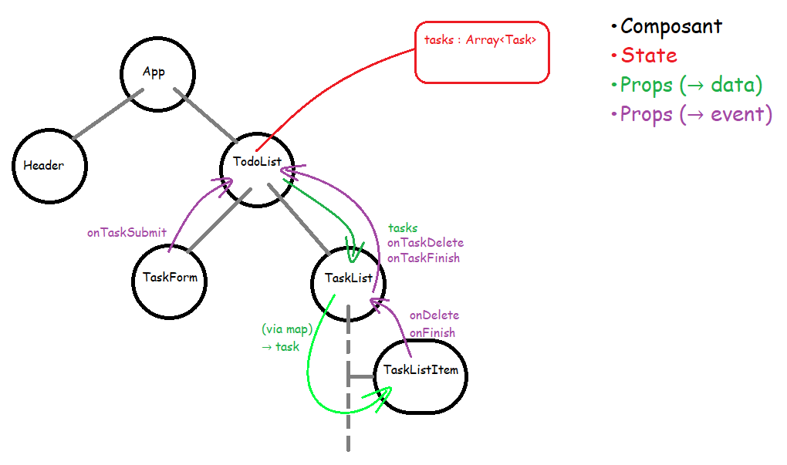

# Exo 05 - TodoList

## TaskForm
Traitement du formulaire: `Composant controlé` OU `Action`

### Composant controlé
- **But** \
  Synchroniser les éléments du formulaire et le state.
- **Avantage** \
  Le state est modifier en temps réel.

### Mecanisme « Action »
- **But** \
  Traiter le formulaire lors de la validation.
- **Avantage** \
  Mise en place simplifier via un objet « FormData ». \
  Possibilité d'utiliser un state via « useActionState ».